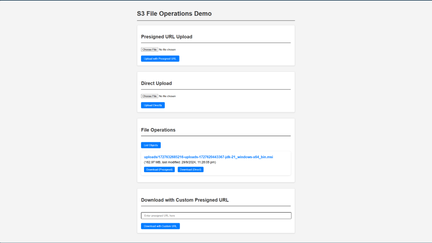

# Presigned URL Demo:

This is a simple demo to show how to generate a presigned URL for an S3 object using the AWS SDK for node.js. We have used localstack to simulate the AWS S3 service locally.


## Prerequisites:
- Node.js
- Docker

# Demo:
The demo is a simple web application that allows the user to upload a file to an S3 bucket. The application generates a presigned URL for the file and displays it to the user. The user can then use the URL to download the file.




## Steps to run the demo:
1. Clone the repository
2. Run the following command to start the localstack service:
    ```bash
    docker run \
      --rm -it \
      -p 127.0.0.1:4566:4566 \
      -p 127.0.0.1:4510-4559:4510-4559 \
      -v /var/run/docker.sock:/var/run/docker.sock \
      -e S3_SKIP_SIGNATURE_VALIDATION=0 \
      localstack/localstack
      ```
3. Install the dependencies and run the application:
    ```bash
    npm install
    node index.js
    ```
4. The code already has the necessary configurations to connect to the localstack service. It will create a bucket 'my-test-bucket' 
5. Access the website at http://localhost:3000  and you can try out the application.


## License:
MIT License